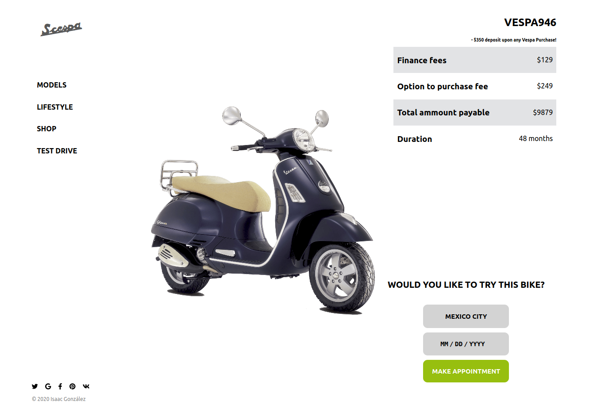

# Vespa Bikes
Get access to all the motorbikes from Vespa, you can choose which model you want to try and make an appointment in your city. Just give a username we can use for your appointment and submit a request!

## Instructions to run the project

+ Open terminal on your workspace with
```
cd /home/projects_workspace/..
```
+ Cloning the project input the next code:
```
git clone git@github.com:idgm5/appointment.git
```
+ Navigate to the folder of the project
```
cd /appointment/
```
Run  `npm install` and then `npm start` finally open your web browser at `http://localhost:3000/`

## Live Website

[Hosted on Heroku](#)

## Extra Feature
- Web App is responsive for mobile, tablets and desktop screens.

## Screenshot


## Built With

* Node.js
* React
* React-DOM
* React-Create-App
* Redux
* npm
* CSS
* ES6

Tools used on this project

- Atom Editor
- Heroku

## Instructions to run the tests

- Open terminal on your workspace with

```
cd /home/projects_workspace/appointment..
```

- Install dependencies

```
npm install
```

- Install Jest

```
npm install --save-dev jest
```

- Install Babel

```
npm i -D @babel/preset-env
```

- Run the tests

```
npm test
```

## Author

👤 **Isaac Gonzalez**

- Github: [@idgm5](https://github.com/idgm5)
- Twitter: [@idgm5](https://twitter.com/idgm5)
- Linkedin: [Isaac Gonzalez](https://www.linkedin.com/in/isaacmunguia)

## Contributing

Contributions, issues and feature requests are welcome!

Feel free to check the [issues](https://github.com/idgm5/catalogue/issues).

## Show your support

Give a ⭐️ if you like this project!

## Acknowledgements

+ [Github](http://github.com/).
+ [The Odin Project](theodinproject.com/).

## License

This project is [MIT](lic.url) licensed.
